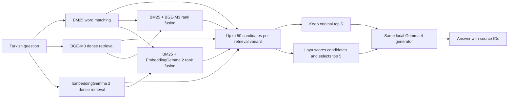

# rag-benchmark

**A reproducible local benchmark for Turkish retrieval-augmented generation.** Compare BM25, BGE-M3 and EmbeddingGemma 2 retrieval, measure what Laya reranking adds, and keep the Gemma 4 answer model fixed.

[Türkçe anlatım](README.tr.md) · [Evaluation protocol](docs/protocol.md) · [Results and validation status](docs/results.md)

**Status:** the **ten-variant pilot is complete: 20 questions × ten variants, 200/200 outputs**, searching all 37,511 passages. Both dense indexes are built. The separate 2,000-question BM25 retrieval baseline is complete; the ten-variant 2,000-question development run and 12,530-question final test have not run. [CI](https://github.com/erendikmenn/rag-benchmark/actions/workflows/ci.yml) · [Measured results and limitations](docs/results.md).

## What the benchmark does

RAG gives an answer model relevant source passages before asking it to answer. This repository measures three separate jobs:

1. **Retrieve:** find up to 50 candidate passages from a shared Turkish corpus.
2. **Rerank:** optionally use Laya to choose the five most useful candidates.
3. **Answer:** give those five passages and the question to the same local Gemma 4 model.



The five retrieval paths are separate experiments. They do not all feed one combined ranking. BM25 and dense retrieval run as parallel sources in each hybrid path; reciprocal-rank fusion combines their rankings.

**Laya is an independent open-source alternative to Jev, developed by Convai Innovations. It is not an official open-source release of TypeSafe Jev.** Here it supplies relevance scores, not the final answer. See the [Laya source](https://github.com/NandhaKishorM/laya) and [multilingual model card](https://huggingface.co/convaiinnovations/laya-multilingual).

## Controlled comparison

| Retrieval | Laya | Answer model |
|---|---|---|
| BM25 | Off | Gemma 4 26B-A4B |
| BM25 | On | Same model and settings |
| BGE-M3 dense | Off | Same model and settings |
| BGE-M3 dense | On | Same model and settings |
| EmbeddingGemma 2 dense | Off | Same model and settings |
| EmbeddingGemma 2 dense | On | Same model and settings |
| BM25 + BGE-M3 | Off | Same model and settings |
| BM25 + BGE-M3 | On | Same model and settings |
| BM25 + EmbeddingGemma 2 | Off | Same model and settings |
| BM25 + EmbeddingGemma 2 | On | Same model and settings |

All variants use the same corpus, questions, candidate budget, final context budget and generator policy. The Laya on/off pair receives the same candidates **within each retrieval path**. Candidate IDs may differ across retrieval paths; that difference is what the retrieval comparison measures. BM25 can return fewer than 50 candidates when fewer documents have a positive match score; the available count is retained rather than padded with unrelated passages.

BGE-M3 is used as a **dense embedding model** in this comparison. Its other retrieval modes are outside the primary experiment. EmbeddingGemma 2 is evaluated on text; this dataset does not test its image or audio capabilities.

## Dataset

The primary source is [METU NLP's RAGTurk](https://huggingface.co/datasets/metunlp/ragturk), described in the [SIGTURK 2026 paper](https://aclanthology.org/2026.sigturk-1.15/). It combines Turkish Wikipedia and CulturaX material with synthetic question–answer pairs and source associations.

The pinned public snapshot yields **37,511 passages and 14,530 usable questions** after reconstructing canonical article JSON and web-article Markdown/offset/QA artifacts. These are smaller than the paper's 58,289 passages and 20,459 questions. The benchmark uses what is actually downloadable; it does not invent missing records or enlarge the corpus by duplicating passages.

| Prepared input | Count |
|---|---:|
| Usable source articles | 8,104 |
| Searchable passages | 37,511 |
| Development questions | 2,000 |
| Final test questions | 12,530 |

The split uses seed 42 and groups source articles, normalized exact duplicate questions and identical gold-evidence text. Near-duplicate leakage is not ruled out. This is a project-specific split, not an upstream official test split. Full ten-variant testing represents **125,300 question–variant outputs**; cached identical generation requests may reduce the number of actual model calls.

The shared retrieval corpus contains documents needed by both splits. Development and test **questions and their source-article groups** must remain separate for tuning. Source documents being searchable is normal for RAG and does not itself mean their answer labels were used to train or tune a model.

The preparation audit rejects four malformed question rows and one article lacking a companion file, while keeping valid passages from eight articles without a question file as retrieval distractors. Synthetic answers and relevance labels are not independently human-verified. Some upstream language/model metadata conflicts with the paper; the adapter preserves that discrepancy without treating metadata alone as a language filter. Counts, exclusions, file hashes and split identity are recorded in `data/ragturk/manifest.json` and summarized in [results](docs/results.md).

## Run locally

The target machine for the first full experiment is an **Apple M4 Max with 128 GB unified memory**. This is the intended evaluation host, not a minimum requirement or a performance claim.

Use Python 3.11–3.13 and [uv](https://docs.astral.sh/uv/). From the repository:

```bash
uv sync --extra models --locked
```

Download the pinned data, model artifacts and macOS Metal runtime explicitly, using the project's environment:

```bash
uv run --locked --extra models rag-benchmark doctor --config configs/ragturk.toml
uv run --locked --extra models rag-benchmark prepare --config configs/ragturk.toml
uv run --locked --extra models rag-benchmark prepare-models --config configs/ragturk.toml --only bge,embeddinggemma,laya,generator --include-runtime
```

Start the local Gemma server in a separate terminal and leave it running:

```bash
uv run --locked --extra models rag-benchmark serve --config configs/ragturk.toml
```

The launcher verifies the configured GGUF's SHA-256 before starting llama.cpp with Metal at `http://127.0.0.1:8080/v1`, serving alias `gemma4`. Model identity and serving alias are separate; the pinned artifact is in [`configs/ragturk.toml`](configs/ragturk.toml). See [model contracts](docs/models.md) for prompts, precision and runtime constraints.

Back in the first terminal:

```bash
# Start with a small development slice.
uv run --locked --extra models rag-benchmark run --config configs/ragturk.toml --split dev --limit 20 --variants bm25,bm25_laya --run-dir runs/pilot

# Generate the report from that run's saved records.
uv run --locked --extra models rag-benchmark report --run-dir runs/pilot

# Create a public export in a new directory.
uv run --locked --extra models rag-benchmark export-report --run-dir runs/pilot --output-dir reports/pilot
```

The export contains `report.md`, `summary.json`, `provenance.json` and `per-query-metrics.jsonl`. It includes selected settings, identifiers and measurements, while excluding questions, answers, source text, prompts and local paths. The output directory must be new.

For a first-stage retrieval check without loading the answer model:

```bash
uv run --locked --extra models rag-benchmark run --config configs/ragturk.toml --split dev --limit 20 --variants bm25 --retrieval-only --run-dir runs/bm25-check
```

That mode has no generated answers and must not be reported as end-to-end RAG quality. Prepared inputs live in `data/ragturk/`: `corpus.jsonl`, `questions.dev.jsonl`, `questions.test.jsonl` and `manifest.json`.

CLI retrieval IDs are `bm25`, `bge`, `embeddinggemma`, `bm25_bge` and `bm25_embeddinggemma`. Append `_laya` for the paired reranking variant. Omit `--variants` to use the matrix in the configuration.

Run the **full ten-variant pilot** on 20 development questions by omitting `--variants`:

```bash
uv run --locked --extra models rag-benchmark run --config configs/ragturk.toml --split dev --limit 20 --run-dir runs/matrix-dev-pilot
```

After checking that pilot, omit `--limit` for all **2,000 development questions × ten variants**, using a new run directory:

```bash
uv run --locked --extra models rag-benchmark run --config configs/ragturk.toml --split dev --run-dir runs/matrix-dev-full
```

Reserve `--split test` for the 12,530 test questions after all settings are frozen, and use a separate run directory. Development runs are the place to diagnose or adjust prompts, fusion and output budgets.

Run the small development slice before attempting the full matrix. The current generator policy is temperature 0, seed 42, at most 512 output tokens and thinking disabled. The earlier pilot used 256 tokens; the shared cap was raised after it exposed truncated interpretation answers. The exact model revisions, local backend, context budget and effective settings belong in the configuration and run manifest. Do not substitute a smaller generator for selected variants and present the output as the same experiment.

Initial dataset/model downloads require network access and any upstream access terms to be satisfied. Once all required artifacts are available locally, the evaluation is intended to run without hosted inference calls. “Local” does not mean model files are bundled in this repository, and “no API charge” does not mean zero hardware or electricity cost.

## Read the measurements correctly

| Measurement | Question it answers |
|---|---|
| Candidate Recall@50 | What fraction of labeled relevant passages reached the reranker? |
| Context Recall@5 | What fraction of labeled relevant passages reached the final context? |
| MRR / nDCG | How early does labeled relevant evidence appear? |
| Answer exact match / token F1 | How closely does the generated text match the reference wording? |
| Stage latency and cache status | Where did this run spend time, and was work reused? |

**High retrieval recall is not high answer accuracy.** A model can receive the correct passage and still answer incorrectly. Conversely, a correct paraphrase may have low token overlap with a synthetic reference. EM/F1 are reproducible text-overlap metrics, not human factuality judgments.

Reranking cannot recover evidence outside its candidate pool. Laya probabilities are not a correctness guarantee; its multilingual checkpoint is not calibrated for this Turkish task. The initial comparison ranks candidates without a hard relevance threshold. Thresholding or fine-tuning requires separate development evidence.

See [the protocol](docs/protocol.md) for split rules, ties, budgets, cache interpretation and publication requirements.

## Results and reproducibility

In the [complete ten-variant pilot](reports/matrix-dev-pilot-512/report.md), **BM25 + EmbeddingGemma 2 without Laya** had the highest observed Recall@5 (**0.9500**) and answer token F1 (**0.5326**). BM25 + BGE-M3 was close on those measures and had the highest nDCG@10. Laya reduced Recall@5 and F1 in all five paired comparisons on these 20 questions. This small development slice does not establish a final winner.

Three of the 200 outputs reached the shared 512-token cap; all remain in the metrics. Eleven outputs reused identical cached generation requests. Prompt suitability and output budgets need broader development evaluation before final settings are frozen. The [2,000-question BM25 baseline](reports/bm25-dev-2000/report.md) and historical two-variant pilots remain available in [results and limitations](docs/results.md).

Each published comparison identifies its dataset revision and audit, configuration, code/model revisions, backend/dtype, query count, exclusions, hardware and cache policy. Per-query candidate/context IDs and stage measurements are retained locally; compact aggregate exports can be checked without redistributing source text.

Cached answers retain completion metadata, including length-limit status; their lookup latency is excluded from fresh-generation measurements. Benchmark runs bypass query-embedding caches and record stage usage. The first query after preparation and the first fresh generation are excluded from their applicable latency summaries. The generator's reported build and server settings participate in run/cache identity. Model/index preparation time remains separate.

The final test split is reserved for reporting after development choices are frozen. An incomplete run or infrastructure smoke test stays labeled as such. There are currently no grounds to claim that EmbeddingGemma 2 beats BGE-M3, Laya improves every retriever, or this pipeline reproduces the RAGTurk paper's published scores.

## Licensing and attribution

The repository's **code is MIT-licensed**. Upstream datasets and model weights keep their own licenses and access conditions. The RAGTurk release is labeled **CC BY-NC-SA 4.0**; publishing this harness under MIT does not relicense its data for commercial use. Raw data, model weights and derived text-bearing run files should remain outside the public source tree unless their redistribution terms are handled explicitly.

This is an independent evaluation project. It is not affiliated with METU NLP, BAAI, Google, Convai Innovations or TypeSafe. Upstream benchmark numbers are background references, not measurements produced by this repository.

Contributions should follow [CONTRIBUTING.md](CONTRIBUTING.md).
