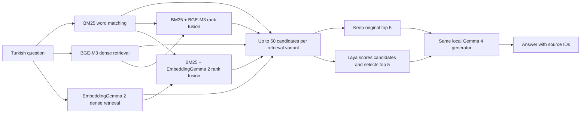

# rag-benchmark

**A reproducible local benchmark for Turkish retrieval-augmented generation.** Compare BM25, BGE-M3 and EmbeddingGemma 2 retrieval, measure what Laya reranking adds, and keep the Gemma 4 answer model fixed.

[Türkçe anlatım](README.tr.md) · [Evaluation protocol](docs/protocol.md) · [Results and validation status](docs/results.md) · [Semantic evaluation](docs/semantic-evaluation.md)

**Status:** the **ten-variant pilot is complete: 20 questions × ten variants, 200/200 outputs**, searching all 37,511 passages. Both dense indexes are built. The separate 2,000-question BM25 retrieval baseline is complete; the ten-variant 2,000-question development run and 12,530-question final test have not run. [CI](https://github.com/erendikmenn/rag-benchmark/actions/workflows/ci.yml) · [Measured results and limitations](docs/results.md).

**Additional experiment runners:** reverse retrieval reuses verified forward media vectors, and the code-query-prefix comparison reuses verified document/chunk vectors. Actual baseline cache checks passed; new reverse-gallery and code-prefix query inference has not run yet. [Commands and limits](docs/multimodal-running.md).

Document QA also has an opt-in cache for identical full generation requests across retrieval cells. Source bytes and runtime settings must match; each task keeps its own reference-based evaluation. This is CPU-tested infrastructure; new QA answer quality and actual call savings remain unmeasured.

## Multimodal benchmark — full-split runs started

The new suite tests **photo, visual document, environmental audio, Turkish speech, video, code and composed image queries**. Its registered scope is **321 retrieval combinations × four ranking conditions = 1,284 method families**, with additional dataset/language and parameter views. These are planned methods, **not completed experiments**.

**Execution resumed at 13:01 Europe/Istanbul on 7 October at the user's request.** The queue is processing the remaining experiments without the previous overnight cutoff. Two GPT-6.1 Sol agents handle CPU development, data checks and evaluation auditing in parallel; heavy local GPU jobs retain one owner. JavaScript dense retrieval has completed; Turkish speech Laya/BGE reranking is complete; Clotho source descriptions and all 126 retrieval conditions on that gallery are complete; the separate additional-relevance protocol is complete too. Photo/video descriptions stopped at the strict output-token limit and need a separately identified recovery; the next document retrieval job is running. Published coverage below counts completed results only. [Current execution status](docs/multimodal-status.md) · [Earlier morning snapshot](docs/multimodal-morning-report.tr.md).

**Main-matrix coverage: 1,684 / 18,460 conditions (9.12%).** This expands the 21 planned collections by method, candidate budget and rerank K; repeated exports and technical smoke checks are excluded. Extra representation/parameter and answer-quality experiments are outside this denominator. This is coverage, not elapsed-work or time remaining. [Count and scope](reports/multimodal/progress-summary.md).

**Visual-document retrieval is complete on ViDoRe V3 computer science:** 215 queries over 1,360 pages, all 63 nonempty combinations of six channels and two candidate budgets (**126 cells**). Standalone-channel results are:

| Method | Hit@5 | Recall@5 | nDCG@10 |
|---|---:|---:|---:|
| BM25 text | 92.09% | 53.53% | 0.6334 |
| BGE-M3 text | 95.35% | 52.45% | 0.6356 |
| EG2 text | 94.42% | 54.40% | 0.6623 |
| EG2 page image | 91.63% | 52.70% | 0.6296 |
| ColQwen2.5 page image | 97.21% | 65.34% | 0.7585 |
| EG2 image + text | 94.42% | 54.54% | 0.6753 |

Hit@5 means at least one relevant page was found; Recall@5 measures coverage of all relevant pages. ColQwen has the highest observed Recall@5 and nDCG@10 among the 63 primary methods. BM25 + EG2 page images + ColQwen has the highest observed Hit@5 (**98.14%**), with lower Recall@5 than standalone ColQwen. These are source-retrieval results, with no reranker or answer generator. [All methods](reports/multimodal/vidore-v3-computer_science-en-all-retrieval/report.md) · [Paired descriptive comparisons](reports/multimodal/vidore-v3-computer_science-en-all-retrieval/paired-comparisons.md).

**Both document text-reranker grids are complete: 882 conditions**, comprising 126 retrieval-only, 378 Laya and 378 BGE cells on the same 215 queries. Each reranker covers 63 retrieval subsets × K=20/50/100 × two budgets. At primary K=50, BGE improves nDCG@10 in 60/63 matched comparisons; EG2 text Hit@5 rises from **94.42% to 97.21%**. It does not improve every method: ColQwen nDCG@10 falls from **0.7585 to 0.7419**. Laya lowers all three reported metrics in all 63 primary comparisons. Both rerankers see source page text, including when retrieval used images. The single connected source group does not support confidence intervals. [Complete comparison and K sweep](reports/multimodal/document-reranker-summary.md).

Full photo retrieval is measured on the same 3,600-image gallery:

| Query language | Queries | EG2 Hit@5 | SigLIP2 Hit@5 | EG2 + SigLIP2 RRF Hit@5 |
|---|---:|---:|---:|---:|
| Turkish | 7,233 | **84.64%** | 59.88% | 76.28% |
| English | 7,200 | **83.75%** | 76.89% | 82.92% |

These are dataset-specific retrieval results, not generated-answer correctness. SigLIP2 uses its 64-token input limit: **56 Turkish queries were explicitly truncated**, and no English query required truncation. This model-input difference is recorded; the table does not isolate truncation's causal effect. EG2's advantage over SigLIP2 is 24.76 percentage points in Turkish (95% paired source-group interval: 23.52–26.02) and 6.86 points in English (5.94–7.82). Equal-weight fusion did not improve EG2 on either split. [Turkish comparison](reports/multimodal/xm3600-tr-native-specialist/paired-comparisons.md) · [English comparison](reports/multimodal/xm3600-en-native-specialist/paired-comparisons.md).

All eight ViDoRe collections are prepared (**19,252 pages / 2,419 base queries**), together with Clotho and Turkish FLEURS. Real local model preflights passed for image, audio, video and joint inputs; these health checks do not measure accuracy. All six code languages are ready (**183,295 functions / 52,561 queries**), together with 1,000 MSR-VTT videos. CIRR official media remains unavailable pending its publisher’s access process. The earlier text RAG pilot below remains a separate experiment.

**Environmental audio gives a different result:** on Clotho's original evaluation protocol (1,045 clips / 5,225 queries), Hit@5 is **11.75% for EG2, 37.42% for CLAP and 26.47% for their fusion**. CLAP exceeds EG2 by 25.67 percentage points (95% source-group interval: 23.25–27.96). This shows why each modality needs its own measurement. [Audio results and paired comparison](reports/multimodal/clotho-v2.1-evaluation-native-specialist/paired-comparisons.md). The separate [1,037-query additional-relevance protocol](reports/multimodal/clotho-dcase2025-additional-relevance-native-specialist/report.md) is also complete; it uses different queries and multiple positives.

**Clotho source descriptions are complete:** local Gemma generated one nonempty English description for each of the 1,045 clips, using source audio only. Queries, labels and media are unchanged. There are 737 distinct description texts; human caption correctness has not been evaluated. All 126 retrieval conditions on this gallery are complete: description-only BM25 / BGE / EG2 Hit@5 is **1.44% / 2.22% / 2.79%**, while native audio EG2 / CLAP is **11.75% / 37.42%**. Joint EG2 audio + description reaches **6.41%**. CLAP has the highest observed Hit@5 across all 63 subsets in both budgets; this generated-text representation did not improve retrieval. Its cause and human caption correctness remain unmeasured. [Full comparison and independent audit](reports/multimodal/clotho-description-retrieval-summary.md).

**The additional-relevance description comparison is also complete:** 126 conditions, 1,037 queries and 3,116 positive labels reuse the same 1,045 descriptions. Native EG2 / CLAP / joint EG2 audio+description Hit@5 is **25.84% / 64.51% / 18.80%**; their Recall@5 is **11.32% / 35.08% / 7.07%**. Multiple relevant clips make these two metrics different. CLAP has the highest observed Hit@5 across all subsets and both budgets. One source group contains 86.50% of queries, so differences are descriptive and confidence intervals are withheld. Six baseline cells overlap earlier results; **120 cells are new**. [Separate protocol and independent audit](reports/multimodal/clotho-additional-description-retrieval-summary.md).

**Turkish speech: full ASR and 62 retrieval conditions are complete.** Whisper transcribed all **743 recordings**, with **7.29% word error rate (965 edits / 13,233 reference words)** and no empty transcripts. Over the same 329 transcript queries, BM25, BGE-M3 and EG2 searching Whisper text each reached **100% Hit@1, Recall@5 and nDCG@10**; EG2 joint audio + Whisper text did too. Native audio alone reached **100% Hit@5 / 99.54% Recall@5**. Queries are the reference transcript text, so this is an easy transcript-to-recording match for text retrieval; it does not establish performance on paraphrased questions or answer correctness. WER measures transcription edits, and its complement is not a semantic-accuracy score. [ASR, all combinations and audit](reports/multimodal/speech-asr-summary.md).

**Turkish speech reranking is now complete: 434 conditions** (62 retrieval-only + 186 Laya + 186 BGE) on all 329 queries and 743 recordings. At primary K=50, BGE preserves Hit@5 in all 31 matched retrieval subsets; Recall@5 improves in three and stays equal in 28. Laya lowers Recall@5 and nDCG@10 in all 31; Hit@5 falls in 25 and stays equal in six. Native audio Recall@5 rises from **99.54% to 100%** with BGE. Both rerankers see Whisper text only. This remains literal transcript matching, not generated-answer correctness. [Full grid, independent audit and 93 paired comparisons](reports/multimodal/speech-reranker-summary.md).

**Video retrieval is complete:** on MSR-VTT 1K-A (1,000 queries / 1,000 videos), Hit@5 is **75.00% for EG2, 53.80% for CLIP frame pooling and 67.10% for their fusion**. EG2 exceeds this CLIP baseline by 21.20 percentage points (95% paired interval: 18.20–24.20). Both use sampled visual frames at 1 fps, capped at 16; this condition does not consume the audio track. [Video comparison](reports/multimodal/msrvtt-1k-a-native-specialist/paired-comparisons.md).

**BM25 completed all six code and eight document collections: 54,980 queries.** The lexical baselines use positive matches only; the remaining dense/fusion/reranker conditions are pending. [Baseline table and exact counts](reports/multimodal/bm25-summary.md).

**Retrieval comparisons are complete for all six code languages:** Python, Ruby, Go, Java, PHP and JavaScript, with 52,561 queries over 183,295 functions in separate galleries. Seven methods × two candidate budgets × six languages give **84 completed cells**; the primary per-channel Hit@5 results are:

| Method | Python Hit@5 | Ruby Hit@5 | Go Hit@5 | Java Hit@5 | PHP Hit@5 | JavaScript* Hit@5 |
|---|---:|---:|---:|---:|---:|---:|
| BM25 | 38.93% | 45.60% | 61.94% | 39.42% | 33.27% | 36.62% |
| BGE-M3 | 62.18% | 68.20% | 87.70% | 63.73% | 57.74% | 58.22% |
| EmbeddingGemma 2 | 84.46% | 86.28% | 96.28% | 83.80% | 75.75% | 79.91% |
| BM25 + BGE-M3 | 59.41% | 64.71% | 85.71% | 61.36% | 54.10% | 56.40% |
| BM25 + EG2 | 69.25% | 70.74% | 89.51% | 71.11% | 62.58% | 64.21% |
| BGE-M3 + EG2 | 76.77% | 78.75% | 93.39% | 76.99% | 70.81% | 71.25% |
| BM25 + BGE-M3 + EG2 | 73.56% | 74.94% | 92.07% | 74.66% | 67.48% | 68.55% |

*JavaScript uses a separate input protocol: two overlength functions share lossless segmentation boundaries across both encoders, producing 14,084 chunks for 13,981 source functions. Function score is maximum chunk cosine. The other five languages embed whole functions.

EG2 leads these six fixed code-search tests; equal-weight RRF fusion did not improve it. Source comments/reference docstrings were removed, and no reranker or answer model is involved. [Both candidate budgets, MRR/nDCG and paired comparisons](reports/multimodal/code-dense-summary.md).

**Dimension sweep complete on seven native dataset views:** 104 dimension/method/budget cells, with the original 768-dimensional results reproduced first. Turkish photo Hit@5 is **84.54% at 512 dimensions versus 84.64% at 768**, using one-third less raw N-vector storage. At 128 dimensions it falls to 66.65%. Video Hit@5 is 74.70% at 512 versus 75.00% at 768. These are dataset-specific point estimates; no inference-speed or statistical-equivalence claim is made. [Dimension results](reports/multimodal-dimensions/README.md).

**Gemma relevance backend check passed:** five fixed queries, 63 retrieval baselines and 63 Gemma reranking cells at K=20; 278 unique query–page pairs received fresh scores. This verifies the local backend and reuse of cached scores, not full-split ranking quality. [Technical check](reports/multimodal/vidore-v3-computer_science-en-gemma-technical-5q/report.md).

**Document answer-evaluation preparation is verified:** all 2,419 questions across eight frozen ViDoRe collections match their published canonical answers and positive source labels. The new preparation module keeps references evaluation-only and separates lexical answer overlap from source-citation overlap. A resumable local answer runner with frozen evidence and cache validation is implemented and CPU-tested; it has not generated answers in this new evaluation. The execution planner schedules controls once per collection and retrieved-evidence tests per completed retrieval identity, with source/report hashes enforced before inference. No new QA answers or semantic accuracy have been measured. [QA execution scope](reports/multimodal-qa-execution-plan-summary.json) · [Readiness audit](reports/multimodal-qa-readiness.json) · [Evaluation setup and limits](docs/multimodal-running.md#document-answer-evaluation-preparation).

**Reverse-task data is prepared, with execution still pending:** image-to-caption views retain 3,600 image queries in each of Turkish and English; audio-to-reference-transcript retains 743 recordings and 329 text targets. A separate EG2 media-query/text-gallery runner is now implemented and CPU-tested; actual model execution and reverse accuracy remain unmeasured. [Execution protocol](docs/multimodal-running.md#separate-reverse-retrieval) · [Prepared counts and source hashes](reports/multimodal-reverse-readiness.json).

Whisper's Transformers cache-compatibility fix passed regression tests and real [CPU](reports/multimodal-whisper-cpu-preflight.json) and [MPS](reports/multimodal-whisper-mps-preflight.json) checks on 16.92- and 36.84-second recordings, preserving all samples. A later macOS Metal compiler-service failure interrupted new model jobs; a fresh GPU process and both real Whisper checks passed during recovery. The recovered full ASR run and its retrieval comparison are now complete; other queued experiments remain incomplete.

[All measured runs](reports/multimodal/README.md) · [Run locally](docs/multimodal-running.md) · [Live execution status](docs/multimodal-status.md) · [Detailed experiment plan (Turkish)](docs/multimodal-plan.tr.md) · [Complete planned variant registry](configs/multimodal-variants.csv)

## What the benchmark does

RAG gives an answer model relevant source passages before asking it to answer. This repository measures three separate jobs:

1. **Retrieve:** find up to 50 candidate passages from a shared Turkish corpus.
2. **Rerank:** optionally use Laya to choose the five most useful candidates.
3. **Answer:** give those five passages and the question to the same local Gemma 4 model.



The five retrieval paths are separate experiments. They do not all feed one combined ranking. BM25 and dense retrieval run as parallel sources in each hybrid path; reciprocal-rank fusion combines their rankings.

**Laya is an independent open-source alternative to Jev, developed by Convai Innovations. It is not an official open-source release of TypeSafe Jev.** Here it supplies relevance scores, not the final answer. See the [Laya source](https://github.com/NandhaKishorM/laya) and [multilingual model card](https://huggingface.co/convaiinnovations/laya-multilingual).

## Controlled comparison

| Retrieval | Laya | Answer model |
|---|---|---|
| BM25 | Off | Gemma 4 26B-A4B |
| BM25 | On | Same model and settings |
| BGE-M3 dense | Off | Same model and settings |
| BGE-M3 dense | On | Same model and settings |
| EmbeddingGemma 2 dense | Off | Same model and settings |
| EmbeddingGemma 2 dense | On | Same model and settings |
| BM25 + BGE-M3 | Off | Same model and settings |
| BM25 + BGE-M3 | On | Same model and settings |
| BM25 + EmbeddingGemma 2 | Off | Same model and settings |
| BM25 + EmbeddingGemma 2 | On | Same model and settings |

All variants use the same corpus, questions, candidate budget, final context budget and generator policy. The Laya on/off pair receives the same candidates **within each retrieval path**. Candidate IDs may differ across retrieval paths; that difference is what the retrieval comparison measures. BM25 can return fewer than 50 candidates when fewer documents have a positive match score; the available count is retained rather than padded with unrelated passages.

BGE-M3 is used as a **dense embedding model** in this comparison. Its other retrieval modes are outside the primary experiment. In this RAGTurk pilot, EmbeddingGemma 2 is evaluated on text; its image/audio results belong to the separate multimodal suite above.

## Dataset

The primary source is [METU NLP's RAGTurk](https://huggingface.co/datasets/metunlp/ragturk), described in the [SIGTURK 2026 paper](https://aclanthology.org/2026.sigturk-1.15/). It combines Turkish Wikipedia and CulturaX material with synthetic question–answer pairs and source associations.

The pinned public snapshot yields **37,511 passages and 14,530 usable questions** after reconstructing canonical article JSON and web-article Markdown/offset/QA artifacts. These are smaller than the paper's 58,289 passages and 20,459 questions. The benchmark uses what is actually downloadable; it does not invent missing records or enlarge the corpus by duplicating passages.

| Prepared input | Count |
|---|---:|
| Usable source articles | 8,104 |
| Searchable passages | 37,511 |
| Development questions | 2,000 |
| Final test questions | 12,530 |

The split uses seed 42 and groups source articles, normalized exact duplicate questions and identical gold-evidence text. Near-duplicate leakage is not ruled out. This is a project-specific split, not an upstream official test split. Full ten-variant testing represents **125,300 question–variant outputs**; cached identical generation requests may reduce the number of actual model calls.

The shared retrieval corpus contains documents needed by both splits. Development and test **questions and their source-article groups** must remain separate for tuning. Source documents being searchable is normal for RAG and does not itself mean their answer labels were used to train or tune a model.

The preparation audit rejects four malformed question rows and one article lacking a companion file, while keeping valid passages from eight articles without a question file as retrieval distractors. Synthetic answers and relevance labels are not independently human-verified. Some upstream language/model metadata conflicts with the paper; the adapter preserves that discrepancy without treating metadata alone as a language filter. Counts, exclusions, file hashes and split identity are recorded in `data/ragturk/manifest.json` and summarized in [results](docs/results.md).

## Run locally

The target machine for the first full experiment is an **Apple M4 Max with 128 GB unified memory**. This is the intended evaluation host, not a minimum requirement or a performance claim.

Use Python 3.11–3.13 and [uv](https://docs.astral.sh/uv/). From the repository:

```bash
uv sync --extra models --locked
```

Download the pinned data, model artifacts and macOS Metal runtime explicitly, using the project's environment:

```bash
uv run --locked --extra models rag-benchmark doctor --config configs/ragturk.toml
uv run --locked --extra models rag-benchmark prepare --config configs/ragturk.toml
uv run --locked --extra models rag-benchmark prepare-models --config configs/ragturk.toml --only bge,embeddinggemma,laya,generator --include-runtime
```

Start the local Gemma server in a separate terminal and leave it running:

```bash
uv run --locked --extra models rag-benchmark serve --config configs/ragturk.toml
```

The launcher verifies the configured GGUF's SHA-256 before starting llama.cpp with Metal at `http://127.0.0.1:8080/v1`, serving alias `gemma4`. Model identity and serving alias are separate; the pinned artifact is in [`configs/ragturk.toml`](configs/ragturk.toml). See [model contracts](docs/models.md) for prompts, precision and runtime constraints.

Back in the first terminal:

```bash
# Start with a small development slice.
uv run --locked --extra models rag-benchmark run --config configs/ragturk.toml --split dev --limit 20 --variants bm25,bm25_laya --run-dir runs/pilot

# Generate the report from that run's saved records.
uv run --locked --extra models rag-benchmark report --run-dir runs/pilot

# Create a public export in a new directory.
uv run --locked --extra models rag-benchmark export-report --run-dir runs/pilot --output-dir reports/pilot
```

The export contains `report.md`, `summary.json`, `provenance.json` and `per-query-metrics.jsonl`. It includes selected settings, identifiers and measurements, while excluding questions, answers, source text, prompts and local paths. The output directory must be new.

For a first-stage retrieval check without loading the answer model:

```bash
uv run --locked --extra models rag-benchmark run --config configs/ragturk.toml --split dev --limit 20 --variants bm25 --retrieval-only --run-dir runs/bm25-check
```

That mode has no generated answers and must not be reported as end-to-end RAG quality. Prepared inputs live in `data/ragturk/`: `corpus.jsonl`, `questions.dev.jsonl`, `questions.test.jsonl` and `manifest.json`.

CLI retrieval IDs are `bm25`, `bge`, `embeddinggemma`, `bm25_bge` and `bm25_embeddinggemma`. Append `_laya` for the paired reranking variant. Omit `--variants` to use the matrix in the configuration.

Run the **full ten-variant pilot** on 20 development questions by omitting `--variants`:

```bash
uv run --locked --extra models rag-benchmark run --config configs/ragturk.toml --split dev --limit 20 --run-dir runs/matrix-dev-pilot
```

After checking that pilot, omit `--limit` for all **2,000 development questions × ten variants**, using a new run directory:

```bash
uv run --locked --extra models rag-benchmark run --config configs/ragturk.toml --split dev --run-dir runs/matrix-dev-full
```

Reserve `--split test` for the 12,530 test questions after all settings are frozen, and use a separate run directory. Development runs are the place to diagnose or adjust prompts, fusion and output budgets.

Run the small development slice before attempting the full matrix. The current generator policy is temperature 0, seed 42, at most 512 output tokens and thinking disabled. The earlier pilot used 256 tokens; the shared cap was raised after it exposed truncated interpretation answers. The exact model revisions, local backend, context budget and effective settings belong in the configuration and run manifest. Do not substitute a smaller generator for selected variants and present the output as the same experiment.

Initial dataset/model downloads require network access and any upstream access terms to be satisfied. Once all required artifacts are available locally, the core RAG benchmark runs without hosted inference calls. The optional Jev evaluator described below is a separate hosted step. “Local” does not mean model files are bundled in this repository, and “no API charge” does not mean zero hardware or electricity cost.

## Read the measurements correctly

| Measurement | Question it answers |
|---|---|
| Candidate Recall@50 | What fraction of labeled relevant passages reached the reranker? |
| Context Recall@5 | What fraction of labeled relevant passages reached the final context? |
| MRR / nDCG | How early does labeled relevant evidence appear? |
| Answer exact match / token F1 | How closely does the generated text match the reference wording? |
| Stage latency and cache status | Where did this run spend time, and was work reused? |

**High retrieval recall is not high answer accuracy.** A model can receive the correct passage and still answer incorrectly. Conversely, a correct paraphrase may have low token overlap with a synthetic reference. EM/F1 are reproducible text-overlap metrics, not human factuality judgments.

Reranking cannot recover evidence outside its candidate pool. Laya probabilities are not a correctness guarantee; its multilingual checkpoint is not calibrated for this Turkish task. The initial comparison ranks candidates without a hard relevance threshold. Thresholding or fine-tuning requires separate development evidence.

See [the protocol](docs/protocol.md) for split rules, ties, budgets, cache interpretation and publication requirements.

## Optional semantic evaluation

The [Jev evaluation workflow](docs/semantic-evaluation.md) judges saved answers in two separate passes: semantic correctness against references/gold evidence, and grounding using only the passages Gemma actually received. The core RAG pipeline stays local; hosted judging uses OpenRouter's native Decisions API with `typesafe/jev-1.13`, `OPENROUTER_API_KEY`, explicit opt-in and a request budget that defaults to zero. The verified served snapshot is `typesafe/jev-1.13-20260917`.

The [Jev pilot](reports/semantic-pilot-openrouter/report.md) is complete: **200 answers, 20 unique questions, 319/319 validated requests** after deduplicating 400 logical tasks. EmbeddingGemma 2 and BM25+EmbeddingGemma 2 without Laya each received **14/20 `correct` labels (70%)**. Reported benchmark judging cost was **US$0.031974726**, excluding controls. These are exploratory Jev labels, not human-verified accuracy: inspection found a missed grounding contradiction, and the [synthetic controls](reports/semantic-controls-tr/report.md) also exposed errors. Turkish human calibration remains pending; the 12,530-question final test has not been evaluated. See [the full interpretation](docs/semantic-evaluation.md).

The [frozen Jev–Sol comparison](reports/semantic-judge-comparison/report.md) rejudged the same **200 answers from 20 questions**, using the same rubrics and evidence per case. Three fresh parallel Codex agents were configured with requested model **`gpt-6.1-sol`**, effort **`ultra`**; a served checkpoint, API token usage and cost were not verified. Correctness labels agreed on **150/200 (75%)**, grounding labels on **166/200 (83%)**. Jev labeled 105/200 answers correct and Sol 107/200; these pool ten variants and are **not a system success rate or proof that Sol is the better judge**. BM25+EmbeddingGemma 2 received 14/20 correct from each judge, with only 11 shared correct cases; Sol's correct-and-supported count was 13/20. Sol's grouped cases retained agent context, whereas Jev used independent calls. Human adjudication remains pending. See [method limits](docs/semantic-evaluation.md#frozen-jevsol-comparison) and the [Turkish analysis](reports/semantic-judge-comparison/analysis.tr.md).

## Results and reproducibility

In the [complete ten-variant pilot](reports/matrix-dev-pilot-512/report.md), **BM25 + EmbeddingGemma 2 without Laya** had the highest observed Recall@5 (**0.9500**) and answer token F1 (**0.5326**). BM25 + BGE-M3 was close on those measures and had the highest nDCG@10. Laya reduced Recall@5 and F1 in all five paired comparisons on these 20 questions. This small development slice does not establish a final winner.

Three of the 200 outputs reached the shared 512-token cap; all remain in the metrics. Eleven outputs reused identical cached generation requests. Prompt suitability and output budgets need broader development evaluation before final settings are frozen. The [2,000-question BM25 baseline](reports/bm25-dev-2000/report.md) and historical two-variant pilots remain available in [results and limitations](docs/results.md).

Each published comparison identifies its dataset revision and audit, configuration, code/model revisions, backend/dtype, query count, exclusions, hardware and cache policy. Per-query candidate/context IDs and stage measurements are retained locally; compact aggregate exports can be checked without redistributing source text.

Cached answers retain completion metadata, including length-limit status; their lookup latency is excluded from fresh-generation measurements. Benchmark runs bypass query-embedding caches and record stage usage. The first query after preparation and the first fresh generation are excluded from their applicable latency summaries. The generator's reported build and server settings participate in run/cache identity. Model/index preparation time remains separate.

The final test split is reserved for reporting after development choices are frozen. An incomplete run or infrastructure smoke test stays labeled as such. There are currently no grounds to claim that EmbeddingGemma 2 beats BGE-M3, Laya improves every retriever, or this pipeline reproduces the RAGTurk paper's published scores.

## Licensing and attribution

The repository's **code is MIT-licensed**. Upstream datasets and model weights keep their own licenses and access conditions. The RAGTurk release is labeled **CC BY-NC-SA 4.0**; publishing this harness under MIT does not relicense its data for commercial use. Raw data, model weights and derived text-bearing run files should remain outside the public source tree unless their redistribution terms are handled explicitly.

This is an independent evaluation project. It is not affiliated with METU NLP, BAAI, Google, Convai Innovations or TypeSafe. Upstream benchmark numbers are background references, not measurements produced by this repository.

Contributions should follow [CONTRIBUTING.md](CONTRIBUTING.md).
